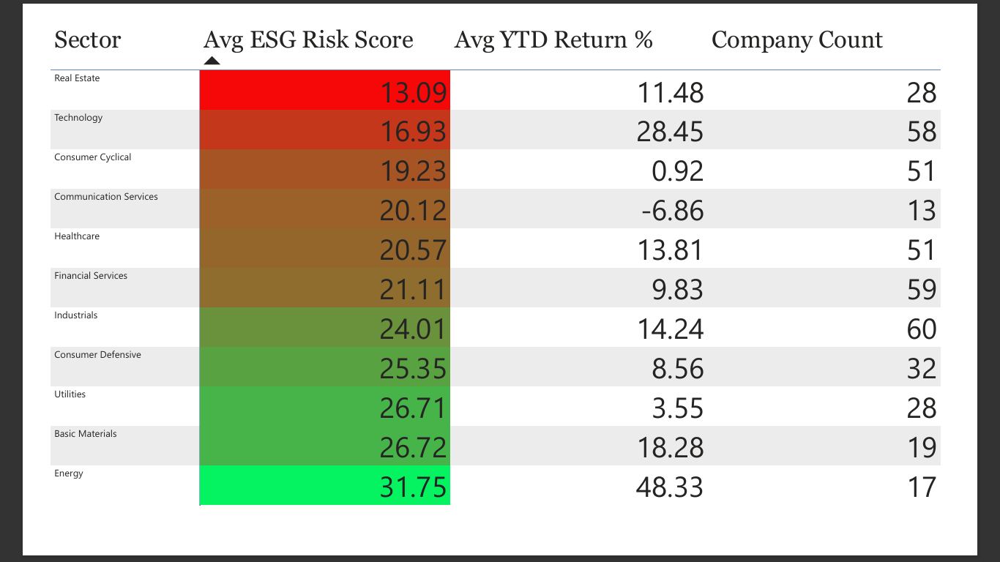

# ESG Risk & Portfolio Performance Analysis

Should an asset manager overweight or underweight high-ESG-risk sectors?

## Business Problem

I'm acting as a data analyst for a fund's portfolio committee, who are considering launching an ESG-tilted equity fund. Before committing, they want evidence-based answers to three questions:

1. Do low-ESG-risk companies actually outperform high-risk companies on return, or is the relationship more complicated?
2. Which S&P 500 sectors carry the most ESG risk, and is that risk already priced into valuations?
3. If we exclude the worst-ESG-risk quintile of companies from the index, what happens to sector diversification and expected return?

## Data Sources

- [S&P 500 ESG Risk Ratings](https://www.kaggle.com/datasets/pritish509/s-and-p-500-esg-risk-ratings) (Kaggle) — company-level ESG risk scores, sector, controversy level
- Stock price/return data pulled via the `yfinance` Python library (free, live source) for YTD returns per ticker

## Tools & Approach

| Stage | Tool | What I did |
|---|---|---|
| Data cleaning & prep | Excel | Cleaned raw CSV, handled missing ESG scores, built pivot tables for sector-level ESG averages |
| Data joins & aggregation | SQL | Joined ESG dataset with return data by ticker, ranked companies into risk quintiles |
| Statistical analysis | Python (pandas, scipy, matplotlib) | Correlation and regression analysis of ESG risk score vs. YTD return; sector-level ANOVA |
| Dashboard | Power BI | Interactive sector risk heatmap, return-by-risk-quintile chart, exclusion-impact simulator |

## Repo Structure

```
esg-risk-portfolio-analysis/
├── README.md
├── data/
│   ├── raw/                     # original Kaggle CSV
│   └── cleaned/                 # cleaned dataset used for analysis
├── excel/
│   └── esg_sector_pivot_analysis.xlsx
├── sql/
│   ├── 01_clean_and_join.sql
│   └── 02_risk_quintile_ranking.sql
├── notebooks/
│   └── esg_risk_return_analysis.ipynb
├── dashboard/
│   ├── esg_dashboard.pbix
│   └── screenshots/
└── images/
    └── dashboard_preview.png
```

## Key Findings

- **Finding 1:** [e.g., "Moderate-ESG-risk companies had the highest median YTD return (X%), outperforming both low-risk (Y%) and high-risk (Z%) companies — suggesting the relationship is non-linear, not a simple 'low risk = high return.'"]
- **Finding 2:** [e.g., "Energy and Utilities carried the highest average ESG risk scores (X), while Technology and Real Estate carried the lowest (Y)."]
- **Finding 3:** [e.g., "Excluding the worst ESG-risk quintile reduced Energy sector weight from X% to Y%, with an estimated Z% change in trailing 12-month portfolio return."]

## Recommendation

[2-3 sentences written as if presenting to the portfolio committee — e.g., "Based on this analysis, I'd recommend against a strict low-ESG-risk screen, since moderate-risk companies showed the strongest returns. A more effective approach may be excluding only the bottom decile of ESG performers rather than a broad risk-based tilt."]

## Dashboard Preview



🔗 [Interactive Power BI Dashboard](#)

## How to Reproduce

1. Clone this repo
2. Download the raw dataset from the Kaggle link above into `data/raw/`
3. Run `sql/01_clean_and_join.sql` against a local PostgreSQL instance (or adapt for your DB)
4. Open `notebooks/esg_risk_return_analysis.ipynb` to reproduce the statistical analysis
5. Open `dashboard/esg_dashboard.pbix` in Power BI Desktop to explore the interactive dashboard
